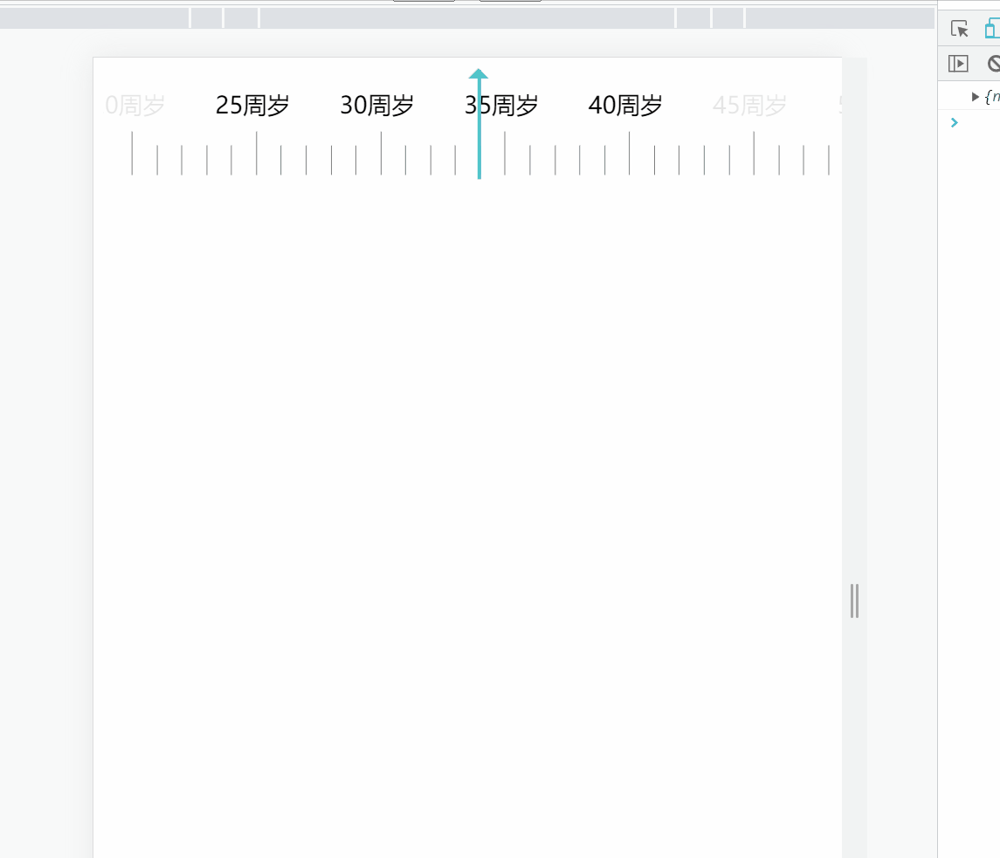

<!--
 * @Author: lafite.rao 827943653@qq.com
 * @Date: 2022-11-27 22:56:12
 * @LastEditors: lafite.rao 827943653@qq.com
 * @LastEditTime: 2023-04-11 14:18:21
 * @FilePath: \lr-ruler\README.md
 * @Description: 这是默认设置,请设置`customMade`, 打开koroFileHeader查看配置 进行设置: https://github.com/OBKoro1/koro1FileHeader/wiki/%E9%85%8D%E7%BD%AE
-->
# lr-ruler

# 图片演示

| 参数 | 说明 |  类型 | 默认值 |
| --- | --- | --- | --- |
|NowNum  | 初始值 |  Number|  100|
|maxNum  | 最大刻度 |  Number|  100|
|minNum  | 最小刻度 |  Number|  0|
|pointerColor  | 指针颜色 |  String|  rgb(97,206,81)|
|ruleWidth  | 刻度尺有多细（可视区一共展示多少个刻度） |  Number|  30|
|ispoint  | 是否启用小数 |  Number|  100|
|oneGridValue  | 每个格子多大 |  Number|  1|
|typeName  | 展示文字（传参即展示） |  String|  |
|graduation  | 刻度分度（默认5格为一大格） |  Number|  5|
|rulerHeight  | ruler的高度 | String/Number |  120|
|colorRange  | 文字变色范围 | String/Number |  10|

